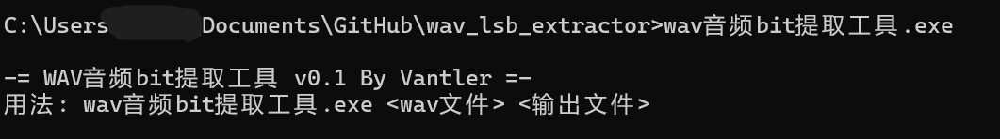
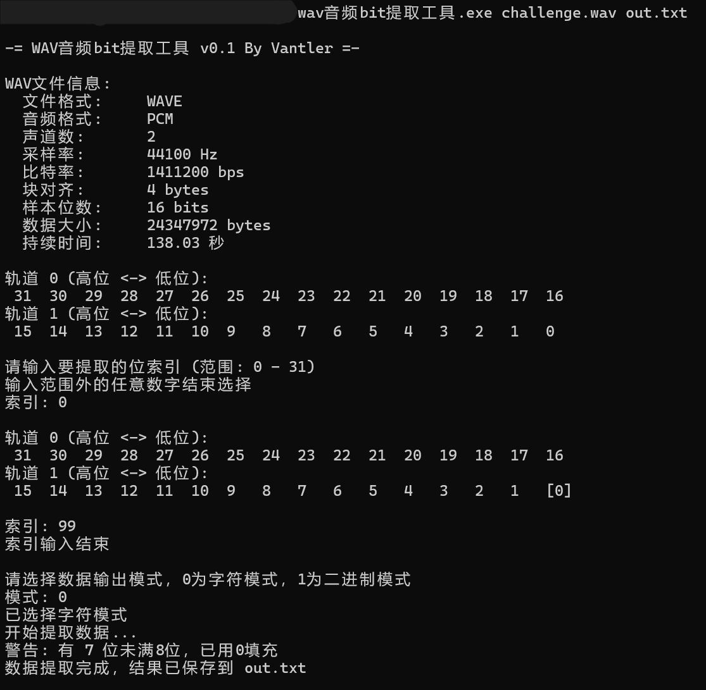

# wav_lsb_extractor

A simple wav file lsb extractor. Tested by codeblock under windows.

wav音频bit提取工具

        一个简单的wav音频提取指定bit的小工具，使用C语言编写，codeblock编译（Mingw），在win下测试通过

        可以识别wav格式，然后指定要提取的bit（输一次是选中，两次是取消）

        有两个输出模式，字符模式是把提取到的bits直接转换成普通字符输出；二进制模式是把bits以“01001011011...”的二进制字符串的形式输出，方便搞逆序之类的事情

        搞CTF时候遇到wav lsb实在是没有好用的工具，而且我讨厌python（需要单独环境，还莫名其妙的坏依赖库），就写个这个没有依赖，独立绿色的小玩意用。

